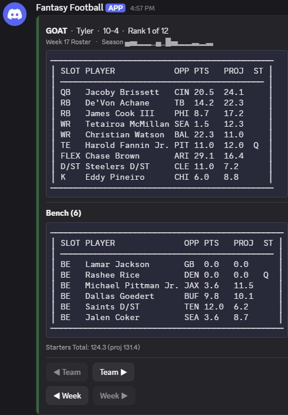
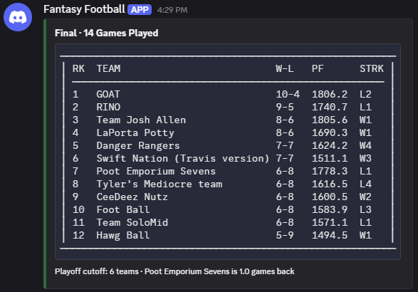
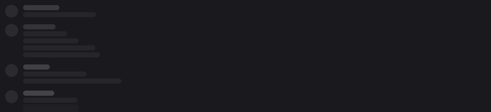
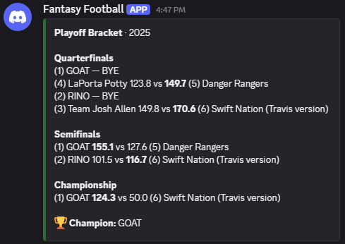
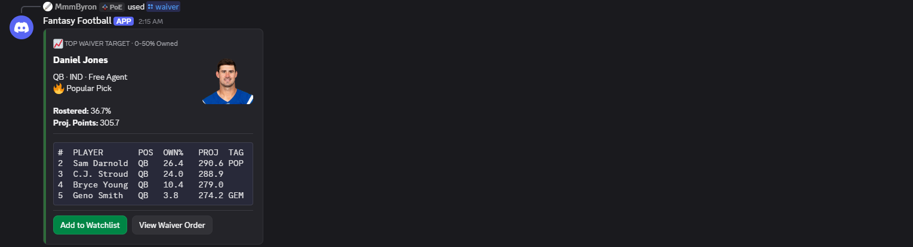

# 🏈 ESPN Fantasy Football Discord Bot

A Discord bot for ESPN Fantasy Football leagues — standings, matchups, waiver suggestions, trade analysis, and a bunch of other stuff, pulled live from ESPN's API and posted as clean, readable tables right in your server.

> This is a personal project I built for my own league and I'm sharing it in case it's useful to someone else. It works well for me; I can't promise ongoing support, but feel free to use it or fork it yourself.

## Features

Handles multiple leagues at once — your own, and everyone else's in the server if they want to register theirs too. Pulls live scores and standings with a short cache so it's not hammering ESPN's API every time someone runs a command, and has a handful of commands beyond the basics: power rankings, who's actually been lucky this season, waiver pickups, sleeper picks, trade analysis. Works with private leagues too, if you're willing to hand it your ESPN session cookies (read the warning below before you do that).

Everything renders as plain bordered tables instead of an image — loads instantly, stays sharp at any zoom level, and nothing ever gets cut off with an ellipsis, even a 30-character joke team name. The playoff bracket is a real bracket too, built from actual recorded matchups rather than a guessed seeding formula.

## Quick Start

### Prerequisites

- Python 3.8+
- A Discord bot application (see below)
- An ESPN Fantasy Football league — public or private

### Installation

```bash
git clone https://github.com/ryanmachancock/ff-discord-bot.git
cd ff-discord-bot
pip install -r requirements.txt
cp .env.example .env
```

Fill in `.env` (see [Configuration](#configuration)), then run:

```bash
python bot.py
```

## Configuration

### Discord Bot Setup

1. Go to the [Discord Developer Portal](https://discord.com/developers/applications)
2. Create a new application and bot
3. Copy the bot token
4. Invite the bot to your server with the permissions it needs (Send Messages, Use Slash Commands, Embed Links)

### Environment Variables

```env
# Discord Bot Configuration
DISCORD_TOKEN=your_discord_bot_token_here

# ESPN Fantasy Football League Configuration
ESPN_LEAGUE_ID=your_league_id_here
ESPN_SEASON_ID=2026

# ESPN Authentication (only needed if this is a private league)
ESPN_SWID=your_swid_cookie_value_here
ESPN_S2=your_espn_s2_cookie_value_here
```

### Finding ESPN Credentials

Public leagues don't need any of this — skip straight to running the bot. For a private league:

1. Log into [ESPN Fantasy Football](https://fantasy.espn.com)
2. Open dev tools (F12) → Application/Storage → Cookies → fantasy.espn.com
3. Copy `SWID` (including the curly braces) and `espn_s2` (a long URL-encoded string)

**⚠️ Know what you're sharing:** `SWID` and `espn_s2` are your live ESPN
login session, not a throwaway ID — anyone who has both can act as you on
ESPN (mess with your fantasy lineup, and whatever else that ESPN account is
signed into) until the session expires or you log out elsewhere. If members
of your server are registering their own private leagues, tell them to DM
the bot with these instead of typing them in a channel — Discord shows a
slash command's typed arguments to everyone in the channel even when the
bot's own reply is private. The bot encrypts them at rest with Windows
DPAPI before they touch disk, but whoever's running the bot still has to be
someone you'd trust with an ESPN session, same as any bot you hand
credentials to.

## Commands Reference

Data commands render as bordered monospace tables rather than an image, so results load instantly and nothing truncates no matter how much data or how long a name gets. See `CLAUDE.md` for the exact style these are held to.

### Core Team Commands

| Command | Description | Parameters |
|---------|-------------|------------|
| `/team` | Roster card for a team (starters and bench), with Prev/Next buttons to browse teams and weeks | `team_name` |
| `/compare` | Season-long comparison of two teams | `team1`, `team2` |
| `/player` | Player card with season stats | `player_name` |

### League Information & Analytics

| Command | Description | Parameters |
|---------|-------------|------------|
| `/standings` | Regular season standings with records and points | None |
| `/playoffs` | Championship playoff bracket, built from real recorded matchups | None |
| `/stats` | League superlatives -- consistency, luck, schedule strength | None |
| `/insights` | League pulse -- who's hot, who's cold, by season PPG | None |
| `/detailed_stats` | Power rankings and league-wide scoring analytics | None |
| `/scoreboard` | Live scoreboard for all of this week's matchups | None |
| `/league_info` | Display league settings and configuration | None |

### Analysis & Strategy

| Command | Description | Parameters |
|---------|-------------|------------|
| `/matchup` | Head-to-head matchup card for this week | `team1`, `team2` (optional) |
| `/trade` | Trade analysis between two teams | `team1`, `team2`, `team1_players`, `team2_players` |
| `/waiver` | Top waiver wire pickup recommendations | `position` (optional), `min_owned`, `max_owned` |
| `/sleeper` | Find undervalued sleeper picks | `position` (optional) |

### Multi-League Management

| Command | Description | Parameters |
|---------|-------------|------------|
| `/register_league` | Register a new ESPN league | `league_id`, `league_name`, `swid` (optional), `espn_s2` (optional) -- DM the bot if providing swid/espn_s2 |
| `/my_leagues` | View your registered leagues | None |
| `/switch_league` | Switch your default league | `league_name` |
| `/remove_league` | Remove a league from your account | `league_name` |
| `/all_leagues` | View all available server leagues | None |
| `/compare_cross_league` | Compare teams from different leagues | `team1`, `team2`, `league1` (optional), `league2` (optional) |

### Utility & Debug Commands

| Command | Description | Parameters |
|---------|-------------|------------|
| `/help` | Quick command reference for members | None |
| `/welcome` | Admin setup and operations guide (admin only) | None |
| `/league_status` | Show current default league and status | None |
| `/ping` | Check if bot is responsive | None |
| `/sync_commands` | Manually sync commands (admin only) | None |
| `/debug_autocomplete` | Test autocomplete functionality (admin only) | None |

## Command Examples

### `/team` - Team Roster Display
>

### `/compare` - Team Comparison
>

### `/standings` - League Standings
>

### `/stats` - League Analytics
>

### `/playoffs` - Playoff Bracket
>

### `/waiver` - Waiver Wire Recommendations
>

## Advanced Usage

### Multi-League Setup

1. Use `/register_league` to add each of your leagues
2. Use `/switch_league` to change your default league
3. Use `/compare_cross_league` to compare teams across different leagues
4. Use `/all_leagues` to see all available leagues in your server

### Private League Access

```bash
/register_league league_id:123456 league_name:"My Private League" swid:"{YOUR-SWID}" espn_s2:"YOUR-ESPN-S2-COOKIE"
```

**DM the bot this command** rather than running it in a server channel -- see the warning under [Finding ESPN Credentials](#finding-espn-credentials) for why.

## Troubleshooting

**Bot not responding to commands:**
- Check that the bot has proper permissions in your Discord server
- Verify the bot token is correct in your `.env` file
- Use `/ping` to test basic connectivity

**"League not found" errors:**
- Verify your league ID is correct (found in the ESPN URL)
- For private leagues, make sure your SWID and espn_s2 cookies are still valid -- they do expire
- Check that the season year matches your league settings

**ESPN API timeout errors:**
- ESPN's API can be slow during peak times (Sunday game days especially)
- The bot retries automatically on a timeout
- Commands will show "Fetching data..." while they wait on ESPN

### Getting Help

- Use `/help` for a quick command reference
- Server admins: use `/welcome` for the setup and operations guide

## Requirements

See `requirements.txt` for the full list. The main ones:

- `discord.py` - Discord bot framework
- `espn-api` - ESPN Fantasy Sports API wrapper
- `python-dotenv` - Environment variable management

## License

MIT -- see [LICENSE](LICENSE).

---

This bot isn't affiliated with ESPN or Discord. ESPN Fantasy Football is a trademark of ESPN, Inc.
